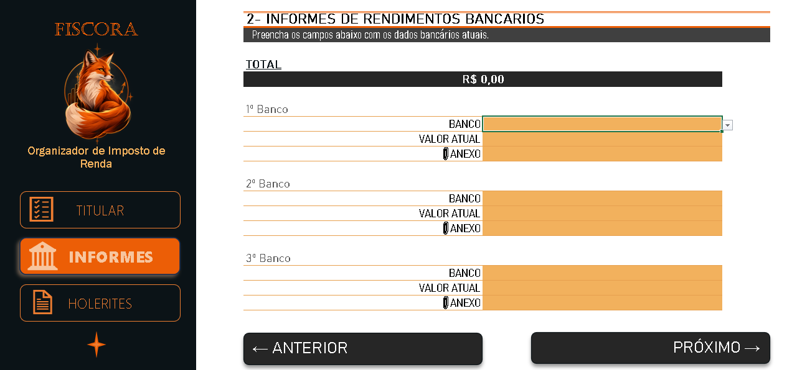

# fiscora-organizer-irpf
Organizador de informações para declaração de imposto de renda desenvolvido em Excel.

## Sobre o projeto
O FISCORA foi desenvolvido como projeto de Excel durante o bootcamp da DIO.
A ferramenta tem como objetivo centralizar informações, padronizar entradas e facilitar a organização dos dados necessários para a declaração.

## Funcionalidade
- Cadastro de dados do titular;
- Organização de informações bancárias;
- Registro de entradas/rendimentos;
- Validação de dados;
- Menus de navegação;
- Listas auxiliares;
- Cálculos automáticos;
- Organização de informações em diferentes abas;

## Identidade visual
O projeto recebeu uma identidade própria chamada FISCORA, representada por uma raposa como símbolo de organização, atenção e estratégia.

## Demonstração
### Tela inicial

### Informações e rendimentos

## IMPORTANTE
> Essa ferramenta tem funcionalidade apenas de organização de informações e não substitui a declaração de Imposto de Renda.
